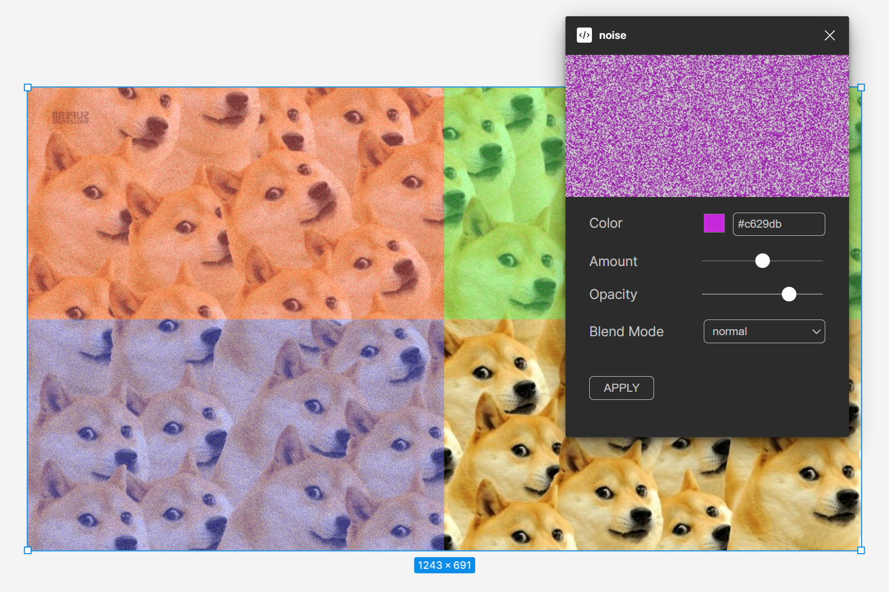

# SHUMI

## This plugin for Figma allows you to easily add noise textures to elements of your designs.

### Features

- Generate noise textures with customizable parameters.
- Control the color, amount, opacity and how the noise is applied (blend mode).
- Apply noise texture to selected elements in Figma.
- Group a textured element for easy further editing.
- Export textures in PNG format for use in other projects.

Questions and suggestions in <a href="https://www.linkedin.com/in/borschevsky">Questions and suggestions in linkedIn</a>

