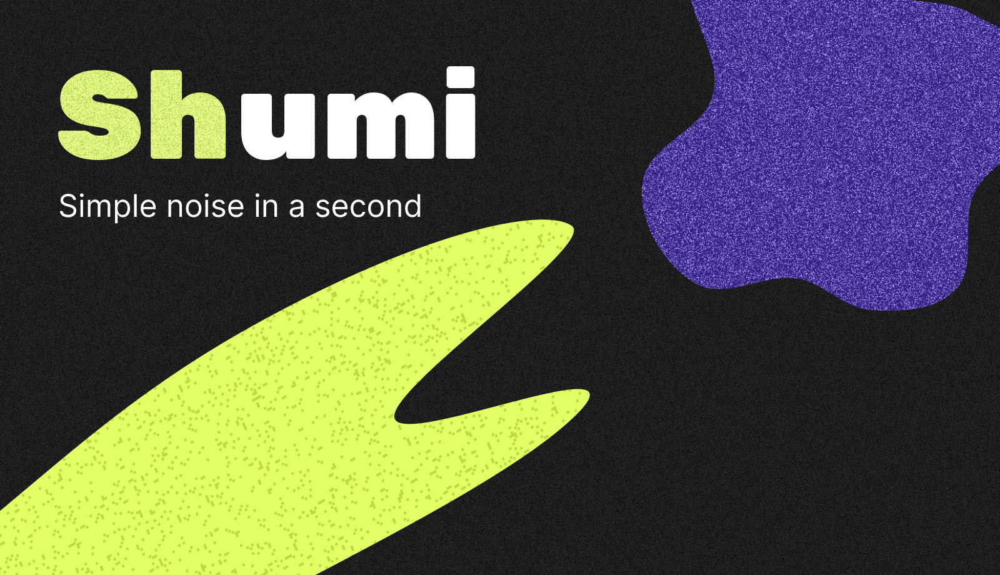
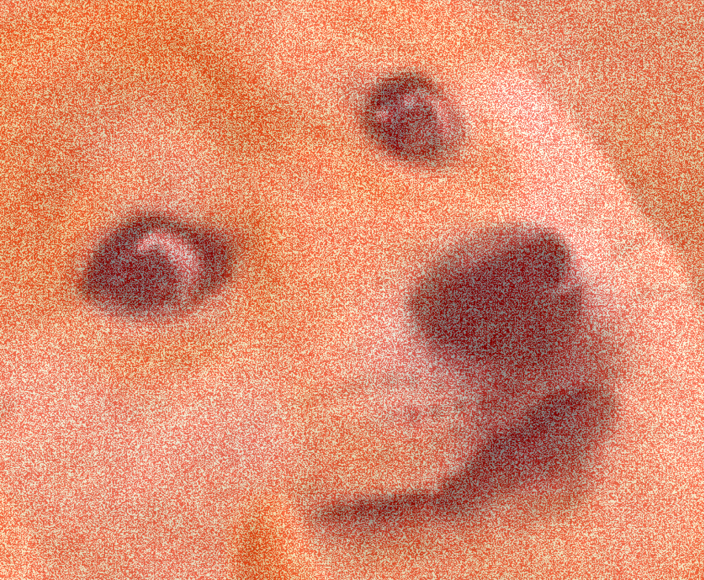

# SHUMI

## This plugin for Figma allows you to easily add noise textures to elements of your designs.

### Features:

- Easy customization.
- Generate noise textures with customizable parameters.
- Control the color, amount, opacity, scale factor and how the noise is applied (blend mode).
- Apply noise texture to selected elements in Figma.
- Texture mapping on geometric shapes and also on vector and text is supported.
- The texture is grouped with the element for easy further editing.
- Ability to export textures.

Questions and suggestions in <a href="https://www.linkedin.com/in/borschevsky">linkedIn</a>

